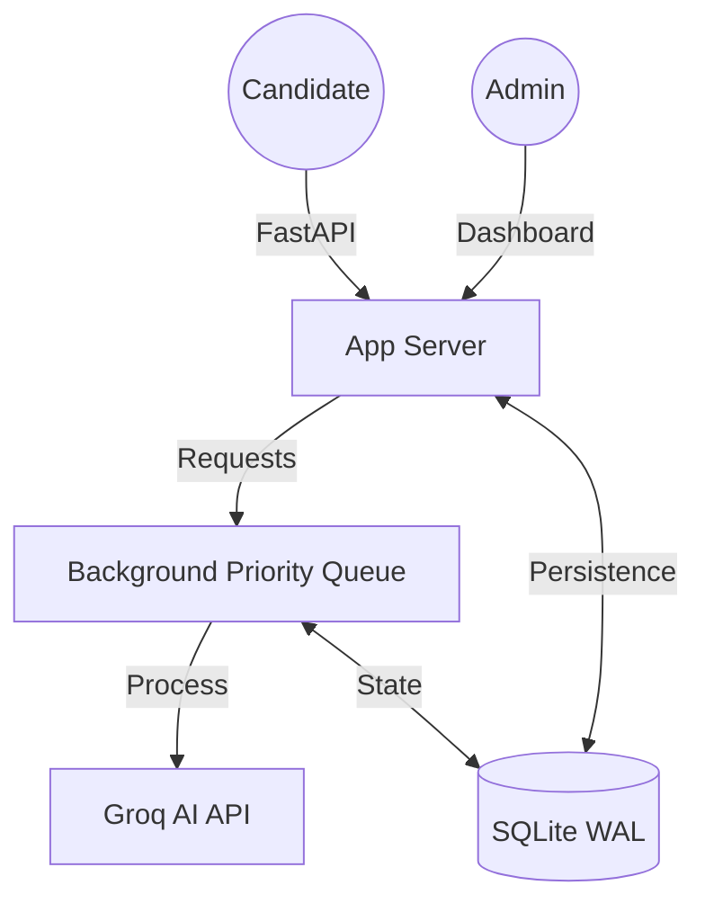

# 🎓 Albab AI-Powered Exam System

[](https://fastapi.tiangolo.com/)
[](https://www.python.org/)
[](https://www.docker.com/)
[](https://groq.com/)
[](LICENSE)

> A production-ready, scalable exam management engine powered by Groq's Llama 3 for automated evaluation of MCQs, short answers, and complex essay questions.

---

## 📖 Overview

The **Albab AI-Powered Exam System** is a sophisticated platform designed to streamline the assessment process. By leveraging State-of-the-Art LLMs via Groq's high-speed API, it provides near-instantaneous, objective grading for both structured and unstructured responses.

### 🌟 Key Highlights
- **💨 Blazing Fast**: Powered by Groq for sub-second AI responses.
- **🛡️ Resilient**: Built-in crash recovery and background evaluation queues.
- **📊 Admin Control**: Full dashboard for exam monitoring and analytics.
- **🐳 DevOps Ready**: Includes specialized Docker configurations and CI/CD pipelines.

---

## ✨ Features

### 🎯 Intelligent Evaluation
- **AI-Powered Grading**: Automated scoring using Groq's Llama 3 70B model.
- **Hybrid Question Support**: 
  - **MCQs**: Single and Multi-select support with partial grading.
  - **Subjective**: Short answers and Essays with contextual feedback.
- **Feedback Engine**: Provides candidates with constructive, AI-generated reasoning for their scores.

### 🔒 Enterprise Security
- **Anti-Cheat Measures**: Server-side time enforcement and session locking.
- **Resume Capability**: Candidates can resume exams after network failures or browser crashes.
- **Data Integrity**: SQLite with **Write-Ahead Logging (WAL)** ensures zero data loss during concurrent access.

### 🛠️ Admin Capabilities
- **Flexible Exam Design**: Create exams via AI generation or manual input.
- **Multi-Lingual**: Native support for English and Bengali assessments.
- **Live Monitoring**: Track active sessions, time remaining, and submission status in real-time.
- **Negative Marking**: Granular control over penalty scoring per section.

---

## 🏗️ System Architecture



### 📁 Technical Blueprint
1.  **Core** (`app.py`): FastAPI engine handling high-concurrency requests.
2.  **Logic** (`groq_analyzer.py`): Intelligent prompt engineering for grading and generation.
3.  **Concurrency** (`evaluation_queue.py`): Custom-built priority queue with exponential backoff and retry logic.
4.  **Data** (`db.py`): Optimized thread-safe database layer.

---

## 🚀 Getting Started

### 📦 Quick Run (Docker Compose)
The fastest way to get started in a production-like environment:

```bash
docker-compose up -d
```
*Access the app at: `http://localhost:7894`*

### 🐍 Local Development Setup

#### 1. Environment Configuration
Clone the repo and initialize your environment:
```bash
git clone https://github.com/rashedulalbab253/GenAI-Assessment-Engine.git
cd ai-exam-system
python -m venv venv
source venv/bin/activate  # Or `venv\Scripts\activate` on Windows
pip install -r requirements.txt
```

#### 2. Environment Variables
Create a `.env` file from the template:
```bash
cp .env.example .env
```
Update these critical values:
- `API_KEY`: Your Groq API key.
- `ADMIN_SECRET_KEY`: A secure password for the dashboard.
- `PORT`: Default is 8000.

#### 3. Launch
```bash
python main.py
```

---

## 🌍 CI/CD & Deployment

### **Automated Build Pipeline**
This repository is configured with **GitHub Actions** (`.github/workflows/docker-publish.yml`) to automatically build and push Docker images to Docker Hub.

#### **Setup Requirements:**
Ensure your GitHub Repository has the following secrets:
- `DOCKER_USERNAME`: Your Docker Hub handle.
- `DOCKER_PASSWORD`: Your Docker Hub Access Token.

---

## 📊 Usage Guide

### **Admin Workflow**
1.  **Login**: Access `/admin/login` using your `ADMIN_SECRET_KEY`.
2.  **Design**: Use the "Create Exam" tool. Define sections (e.g., "General Knowledge", "Coding").
3.  **Deploy**: Copy the generated link and share it with candidates.
4.  **Monitor**: Keep the dashboard open to watch candidates take the exam in real-time.

### **Candidate Workflow**
1.  **Entry**: Join via the unique exam link.
2.  **Assessment**: Complete questions; answers are auto-saved to prevent loss.
3.  **Completion**: Submit the exam. View status at the evaluation tracker.

---

## 🛡️ Security Best Practices
- **Secrets**: Never commit your `.env` file.
- **API Keys**: Use Groq [personal access tokens](https://console.groq.com/keys) with limited scope.
- **Database**: Periodically back up the `exam_system.db` file.
- **Production**: In production, set `RELOAD=false` in your `.env`.

---

## 🤝 Contributing

We welcome contributions! 
1.  **Fork** the project.
2.  **Clone** your fork.
3.  Create a **Feature Branch**.
4.  **Submit** a Pull Request.

---

## 📄 License
Distributed under the **MIT License**. See `LICENSE` for more information.

---

**Developed with precision by [Rashedul Albab](https://github.com/rashedulalbab253)** 🚀
